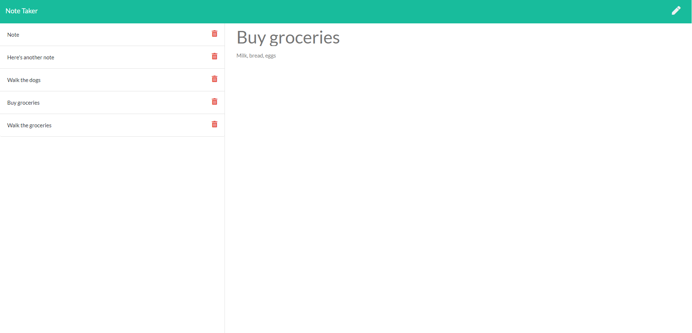

# Note Taker

[Description](#description)

[Licence](#license)

[Installation](#installation)

[Usage](#usage)

[Dependencies](#dependencies)

[Contributing](#contributing)

[GitHub Link](#github-link)


## Description
Take notes using this app!  It uses an express server for the back end.

### License
GNU General Public Licence

### Installation
npm start in the terminal will get you going!

### Usage
Click the pencil button to make a note, and the disk to save.  Trash deletes.

```
app.post('/api/notes', (req, res) => {
    fs.readFile(path.join(__dirname + '/db/db.json'), 'utf-8', (err, noteObj) => {
        let notes = JSON.parse(noteObj)
        let note = req.body
        note.id = Math.random()
        notes.push(note)

        fs.writeFile(__dirname + '/db/db.json', JSON.stringify(notes), 'utf-8', (err) => {
            if (err) console.log(err);
            console.log("new note saved")
        })
    })
    res.send()
});
```



### Dependencies
express NPM

### Contributing
email me at ryanpburnett@yahoo.com

### GitHub Link
https://github.com/ryanpburnett

The repo for this readme generator can be found on RPB's [Github](https://github.com/ryanpburnett/readme-generator) page.